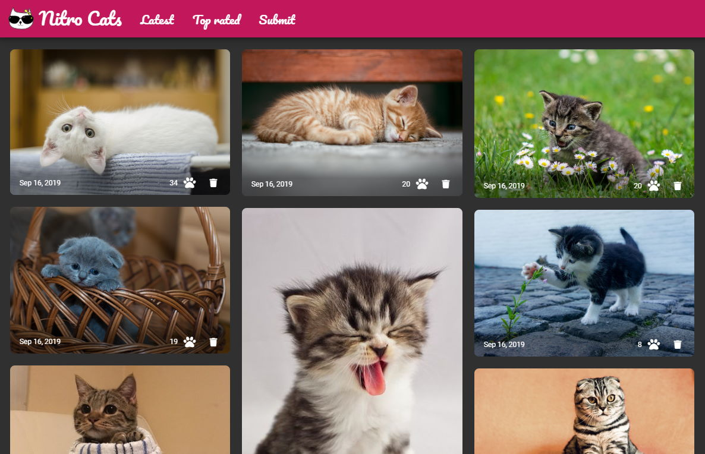

# 😺 nitro-cats



This repository contains the full source code of the Nitro Cats Demo app, built using Nitro stack:

- [Angular](https://angular.io) for the frontend
- [NestJS](https://nestjs.com) for the backend
- Serverless services, using [Azure Functions](https://azure.microsoft.com/services/functions/?WT.mc_id=nitro_cats-github-cxa) and [Azure Storage](https://azure.microsoft.com/services/storage/?WT.mc_id=nitro_cats-github-cxa)

The following additional tools were also used in this demo:

- [@azure/ng-deploy](https://github.com/Azure/ng-deploy-azure)
- [@nestjs/azure-func-http](https://github.com/nestjs/azure-func-http)
- [@nestjs/azure-table-storage](https://github.com/nestjs/azure-storage)
- [@nestjs/azure-storage](https://github.com/nestjs/azure-storage)

## Running the demo

### Requirements

To run this demo, you need an Azure account.
If you don't have an account, you can [create one for free using this link](https://azure.microsoft.com/free/?WT.mc_id=nitro_cats-github-cxa).

### Backend

To run the backend, you first have to create an [Azure Storage account](https://docs.microsoft.com/azure/storage/common/storage-quickstart-create-account?WT.mc_id=nitro_cats-github-cxa) and a [SAS key](https://docs.microsoft.com/azure/storage/common/storage-sas-overview?WT.mc_id=nitro_cats-github-cxa).
You can do that in the [Azure portal](https://portal.azure.com?WT.mc_id=nitro_cats-github-cxa) or using the [Azure CLI](https://docs.microsoft.com/cli/azure/install-azure-cli?view=azure-cli-latest?WT.mc_id=nitro_cats-github-cxa):

```sh
# Create the new resource group
az group create --name <group_name> --location eastus

# Create the storage account
az storage account create --name <storage_account_name> --resource-group <group_name>

# Get the storage account connection string
az storage account show-connection-string --name  <storage_account_name>

# Generate the SAS key
az storage account generate-sas --account-name <storage_account_name> --services btf --resource-types sco --permissions acdlrw --expiry 2020-12-31
```

Then create a `.env` file in the `server` folder with the following information:

```
AZURE_STORAGE_ACCOUNT=<your storage account name>
AZURE_STORAGE_CONNECTION_STRING=<your storage account connection string>
AZURE_STORAGE_SAS_KEY=<your SAS key>
```

After that, go the server folder and run:

```sh
npm install
npm start
```

The server should start and listen on `http://localhost:3000`.

You can test it's working properly with the command `curl http://localhost:3000/api`, which should display `API version: 1.0.0`.

### Frontend

Once you have the backend running, you can run the frontend with these commands:

```sh
npm install
npm run start:local
```

Then go to `http://localhost:4200` in your browser to add some cats!
